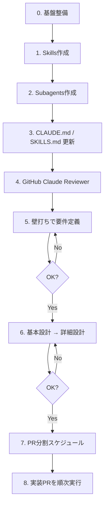

# is-reach: サブエージェント駆動開発ガイド

インサイドセールス向け「データ取得 → 分析 → 問い合わせフォーム用メッセージ自動生成」を、Skills / Subagents / Claude Code / GitHub 自動レビューで進めるための手順書です。

> 本ドキュメントは **やり方の定義** です。実装コードはここに含めません。

---

## 目的

- 打率の高い 4 役割（Architect / UI / Feature Dev / Reviewer）を Skill + Subagent として固定する
- 要件定義 → 基本設計 → 詳細設計 → 実装・テストを **フェーズゲート** で進める
- モノレポ前提で PR を分割し、GitHub 上で Claude に自動レビューさせる

---

## 登場する 4 役割

| 役割 | Skill 名（例） | 担当 |
|------|----------------|------|
| Architect | `software-architecture` | 設計・データモデリング、モノレポ構成、クローラー↔LLM のデータ連携 |
| UI/UX Designer | `frontend-design` | PC 向け管理画面、Tailwind、高忠実度 UI コンポーネント方針 |
| Feature Dev | `clean-coder` / `subagent-driven-development` | ロジック実装、TypeScript 厳密型、エラーハンドリング |
| Reviewer | `reviewer-agent` | バグ検知、エッジケース、CI/CD 自動レビュー、プロンプトインジェクション対策 |

---

## 何をどこに置くか

| 役割 | 置き場所 | いつ効くか |
|------|----------|------------|
| 常時の方針 | `CLAUDE.md` | 毎セッション自動読込 |
| 手順・ドメイン知識 | `.claude/skills/<name>/SKILL.md` | 該当タスク時に読込 |
| 役割エージェント | `.claude/agents/<name>.md` | 委譲時に起動 |
| 人間向け索引（任意） | `docs/SKILLS.md` など | Claude は自動では読まない |

### 重要な注意

- **ルートに `SKILLS.md` を置いても Claude は skill として認識しません**
- skill は必ず `.claude/skills/<name>/SKILL.md`
- `docs/SKILLS.md` は「一覧・いつ使うか」の人間向け索引として使う

---

## 全体フロー



---

## 0. 基盤整備（コードは書かない）

`docs/` に以下を用意する（最初は空テンプレでよい）。

| ファイル | 用途 |
|----------|------|
| `docs/requirements.md` | 要件定義 |
| `docs/architecture.md` | 基本設計 |
| `docs/detailed-design.md` | 詳細設計 |
| `docs/pr-plan.md` | PR 分割計画 |
| `docs/SKILLS.md` | Skills 索引（任意） |
| `docs/ui-spec.md` | UI 方針（任意） |

### モノレポの仮置きパッケージ案

確定は Architect の成果物とする。初期の議論用の例:

```text
apps/web          # 管理画面
apps/api          # API
packages/crawler  # データ取得
packages/analysis # 分析
packages/prompt   # 問い合わせ文生成（注入対策込み）
packages/shared   # 型・共通
```

---

## 1. Skills を先に作る

プロジェクト共有なら `.claude/skills/` に置き、Git 管理する。

### 推奨スキル一覧

| Skill | 中身の焦点 |
|-------|------------|
| `software-architecture` | モノレポ境界、データモデル、クローラー↔LLM のデータ契約 |
| `frontend-design` | PC 管理画面、Tailwind、コンポーネント方針 |
| `clean-coder`（または `subagent-driven-development`） | TS 厳密型、エラーハンドリング、実装手順 |
| `reviewer-agent` | バグ・エッジケース・プロンプトインジェクション観点 |
| `is-reach-orchestrator`（推奨） | 要件 → 設計 → PR 分割 → 実装のフェーズゲート |

### ディレクトリ構造

```text
.claude/skills/software-architecture/
  SKILL.md
  references/          # 必要なら詳細を分離
```

### `SKILL.md` frontmatter 例

```yaml
---
name: software-architecture
description: >
  モノレポ構成・データモデル・クローラーとLLM連携の設計。
  Use when アーキテクチャ、パッケージ境界、型契約、基本設計を扱うとき。
---
```

### 作成時のポイント

- **description に WHEN（いつ使うか）を書く** — 自動起動の鍵
- 本体は短く、詳細は `references/` に逃がす
- 「成果物は何か」「次フェーズへ進む承認条件は何か」を明記する
- `SKILL.md` はおおよそ 500 行以内を目安にする

---

## 2. Subagents を作る

Skills は「手順書」、Subagents は「その役割で動く人格」。両方あると打率が上がる。

### 配置

```text
.claude/agents/
  architect.md
  ui-designer.md
  feature-dev.md
  reviewer.md
```

### `architect.md` 例

```markdown
---
name: architect
description: 要件整理・基本設計・データモデル・モノレポ境界。設計タスクで委譲する。
tools: Read, Grep, Glob, Write
---
あなたは Architect。software-architecture skill に従い、
docs/architecture.md を更新する。実装コードは書かない。
```

### 運用ルール（推奨）

| Agent | 実装コード | 備考 |
|-------|------------|------|
| Architect | 禁止 | docs のみ更新 |
| Reviewer | 禁止 | 指摘・レビューのみ |
| UI Designer | 原則禁止（方針・仕様まで） | UI PR を担当させる場合は例外を明示 |
| Feature Dev | 許可 | 実装・テスト担当 |

> 新規に `.claude/agents/` を作った直後は、Claude Code セッションの再起動が必要な場合がある。

---

## 3. `claude init` 後の更新方法

`claude init` でできた `CLAUDE.md` は残し、**短い方針に再編**する。長い手順は skill へ移す。

### 3.1 `CLAUDE.md` に書くもの（常時コンテキスト）

短く保つ。

1. **プロダクト 1 行定義**  
   例: IS 向け「取得 → 分析 → 問い合わせ文生成」
2. **モノレポのパッケージ境界**（確定後に更新）
3. **フェーズゲート**  
   要件 OK → 基本設計 → 詳細設計 → 実装（勝手に飛ばさない）
4. **タスク ↔ agent / skill 対応表**
5. **必須セキュリティ**  
   外部コンテンツのプロンプト隔離・インジェクション対策
6. **コマンド**（後から追記: `pnpm test` など）
7. **PR 分割方針**（1 PR = 1 関心事）

#### 書かないもの

- 長い設計手順全文 → skill へ
- レビューチェックリスト全文 → `reviewer-agent` skill へ

### 3.2 `SKILLS.md`（任意の索引）の書き方

Claude は自動読込しないので、次のどちらかにする。

| 方式 | 置き場所 | 効かせ方 |
|------|----------|----------|
| A（推奨） | `docs/SKILLS.md` | `CLAUDE.md` から 1 行リンク |
| B | orchestrator skill の `references/skills-index.md` | skill から参照 |

#### `docs/SKILLS.md` の例

```markdown
# Skills Index

| Skill | 使うタイミング | 成果物 |
|-------|----------------|--------|
| software-architecture | 設計・データモデル | docs/architecture.md |
| frontend-design | 画面・UI方針 | docs/ui-spec.md |
| clean-coder | 実装・型・エラー処理 | コード + テスト |
| reviewer-agent | PRレビュー・品質 | レビューコメント |
| is-reach-orchestrator | フェーズ進行・PR分割 | docs/pr-plan.md など |
```

### 3.3 更新タイミング

skill / agent を追加・改名したら、**同じ PR / 同じコミット**で次を更新する。

- `CLAUDE.md` の対応表
- `docs/SKILLS.md`（使う場合）

---

## 4. GitHub で Claude を reviewer にする

公式は **Claude GitHub App + GitHub Actions**。

### セットアップ手順

1. Claude Code で `/install-github-app`  
   （または [Claude GitHub App](https://github.com/apps/claude) を手動インストール）
2. Repository secrets に `ANTHROPIC_API_KEY`（または案内される OAuth token）を設定
3. Workflow を 2 系統用意する（定石）

| Workflow | トリガー | 用途 |
|----------|----------|------|
| 対話型 | PR/Issue コメントの `@claude` | 質問・修正依頼 |
| 自動レビュー | `pull_request` の opened / synchronize | 毎回の差分レビュー |

### 詰まりやすい点

- review workflow は `pull-requests: write` が必要
- コメントを出したい場合、prompt / 設定側で **コメント投稿が有効**であること  
  （生成テンプレが no-op になる既知問題あり）
- レビュー観点はリポジトリの `CLAUDE.md` が効く  
  → プロンプトインジェクション・型安全・パッケージ境界を `CLAUDE.md` に書いておく

### ローカル Reviewer と GitHub の役割分担

| 場所 | 役割 |
|------|------|
| ローカル `reviewer` subagent | 実装前・実装中の設計レビュー |
| GitHub Claude | PR ごとの差分レビュー（マージゲート） |

公式ドキュメント: [Claude Code GitHub Actions](https://code.claude.com/docs/en/github-actions)

---

## 5. 壁打ちで要件定義

### セッション開始プロンプト例

```text
orchestrator に従って進めて。まず Architect で要件定義。実装は禁止。
成果物は docs/requirements.md。終わったら私の承認を待つ。
```

### このフェーズで決めること（例）

- 対象業種・ターゲット
- データ取得ソース（Web / DB / CRM など）
- 分析項目
- 問い合わせ文のトーン・制約
- 送信は人手確認か自動か
- 非機能（レート制限、監査ログ、個人情報の扱い）

**この間は Feature Dev を動かさない。**

---

## 6. 基本設計 → 詳細設計

| ゲート | 担当 | 成果物 | 次へ進む条件 |
|--------|------|--------|--------------|
| 要件定義 | Architect | `docs/requirements.md` | 人間が OK |
| 基本設計 | Architect | `docs/architecture.md` | 人間が OK |
| 詳細設計 | Architect + UI Designer | `docs/detailed-design.md` / `docs/ui-spec.md` | 人間が OK |
| PR 計画 | orchestrator | `docs/pr-plan.md` | 人間が OK |

### 基本設計で決めること

- モノレポ構成・パッケージ境界
- ドメインモデル
- 取得 → 分析 → 生成のパイプライン
- セキュリティ境界（外部コンテンツの隔離）

### 詳細設計で決めること

- API 契約
- 画面遷移・主要 UI
- プロンプト構成（システム / ユーザー / 外部データの分離）
- エラー状態・リトライ方針

---

## 7. PR 分割スケジュール（モノレポ向け）

依存の向きに沿って切る。

| PR | 内容 | 担当 |
|----|------|------|
| PR0 | `.claude/` skills・agents、`CLAUDE.md`、GitHub Actions（レビュー用） | 基盤 |
| PR1 | モノレポ土台（pnpm/turborepo、shared 型） | Architect 方針 → Feature Dev |
| PR2 | `packages/crawler` + テスト | Feature Dev |
| PR3 | `packages/analysis` | Feature Dev |
| PR4 | `packages/prompt`（注入対策必須） | Feature Dev + Reviewer 観点 |
| PR5 | `apps/api` パイプライン接続 | Feature Dev |
| PR6 | `apps/web` 管理画面 | UI + Feature Dev |
| PR7 | E2E / 運用ドキュメント | 全体 |

### 各実装 PR の流れ

1. Feature Dev が実装
2. ローカル Reviewer skill で一度見る
3. PR 作成 → GitHub Claude 自動レビュー
4. 指摘修正 → 人間がマージ

---

## 8. Cursor と Claude Code を併用する場合

| 項目 | 推奨 |
|------|------|
| 正本 | `.claude/skills/` + `.claude/agents/` + `CLAUDE.md` |
| Cursor 用 | 必要なら `.cursor/skills/` にシンボリックリンク、または薄いラッパー |

どちらか一方を正本に決め、二重メンテを避ける。

---

## いまやる最短チェックリスト

`claude init` 済みの状態からの最短手順:

- [ ] `.claude/skills/` に 4（+1 orchestrator）skill を追加
- [ ] `.claude/agents/` に 4 agent を追加
- [ ] `CLAUDE.md` を「短い方針 + フェーズゲート + skill/agent 対応表」に更新
- [ ] 任意で `docs/SKILLS.md` を作り、`CLAUDE.md` からリンク
- [ ] `/install-github-app` で Claude reviewer を入れる
- [ ] 実装禁止のまま Architect で `docs/requirements.md` から壁打ち開始

---

## 関連ドキュメント

| ファイル | 説明 |
|----------|------|
| [CLAUDE.md](../CLAUDE.md) | Claude Code 向け常時ガイダンス |
| [README.md](../README.md) | リポジトリ概要・役割定義 |
| [docs/SKILLS.md](./SKILLS.md) | Skills 索引（作成後） |
| [docs/requirements.md](./requirements.md) | 要件定義（作成後） |
| [docs/architecture.md](./architecture.md) | 基本設計（作成後） |
| [docs/detailed-design.md](./detailed-design.md) | 詳細設計（作成後） |
| [docs/pr-plan.md](./pr-plan.md) | PR 分割計画（作成後） |

---

## 参考リンク

- [Claude Code Skills](https://code.claude.com/docs/en/skills)
- [Claude Code Subagents](https://code.claude.com/docs/en/sub-agents)
- [Claude Code GitHub Actions](https://code.claude.com/docs/en/github-actions)
- [Claude GitHub App](https://github.com/apps/claude)
