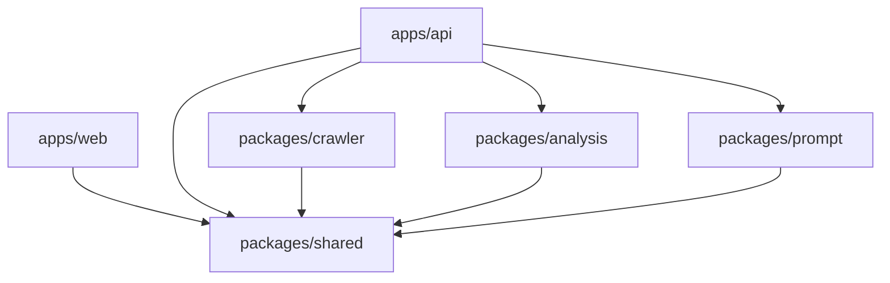
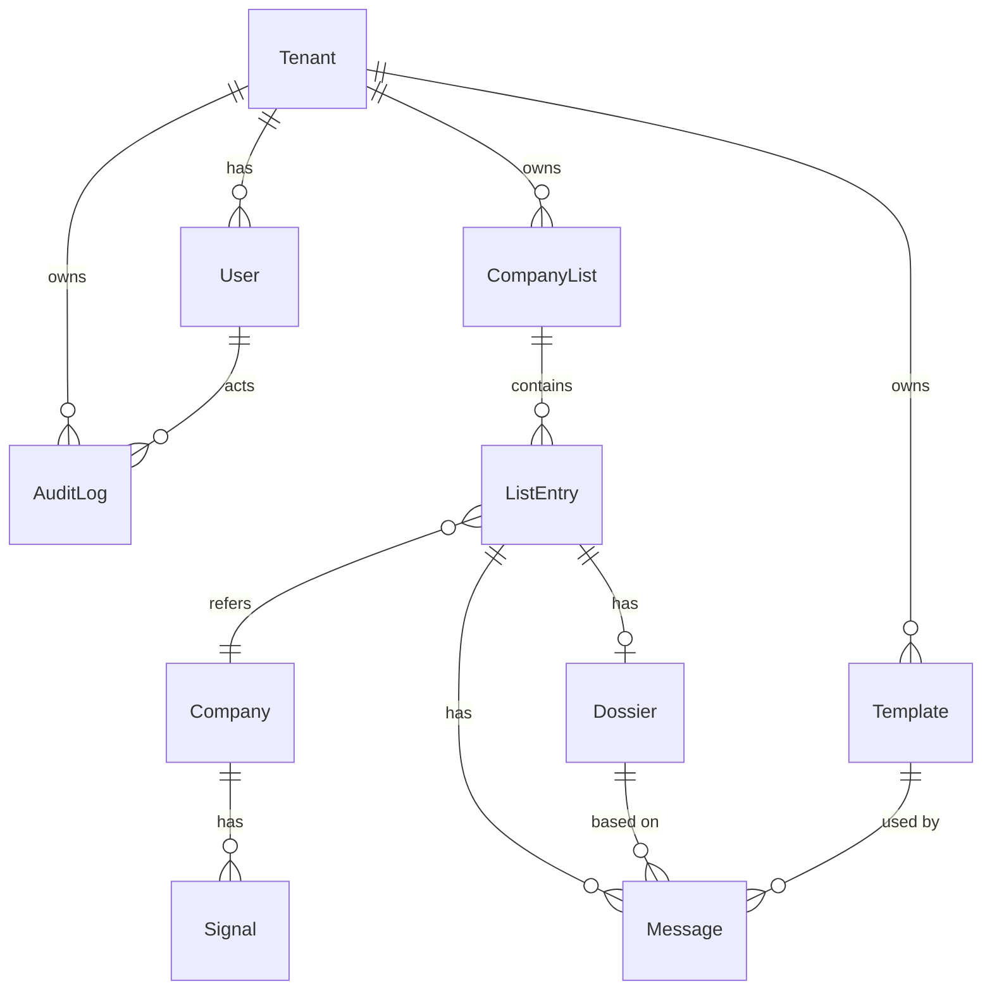
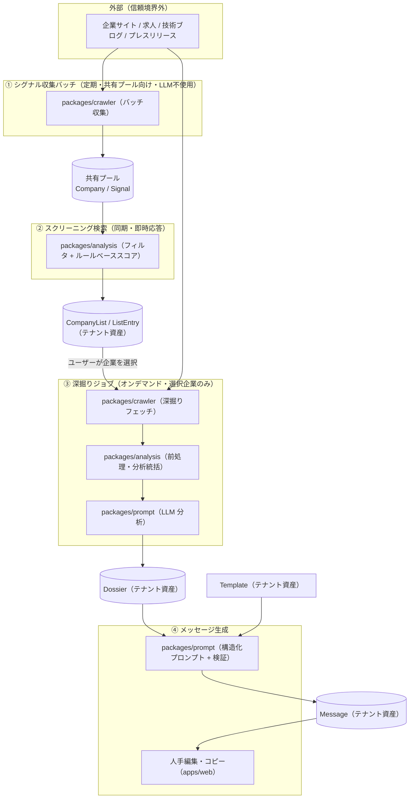
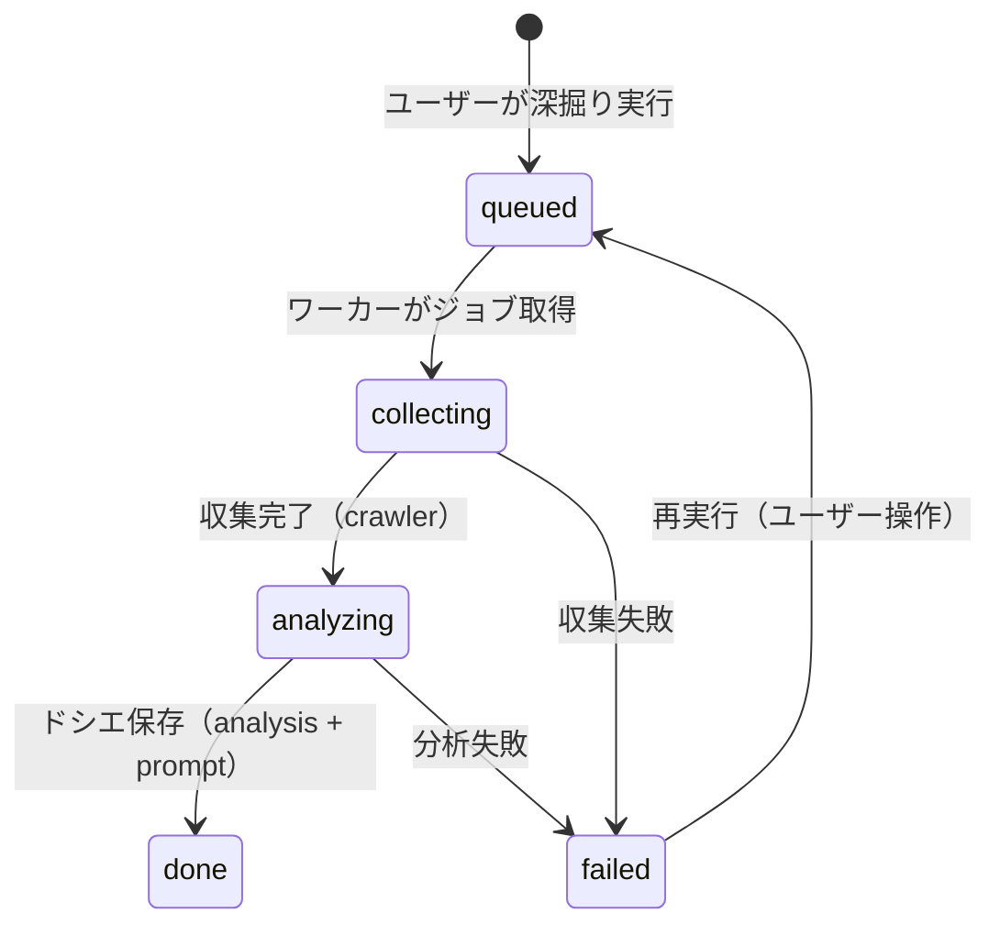
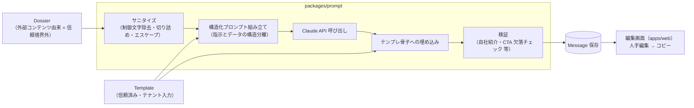
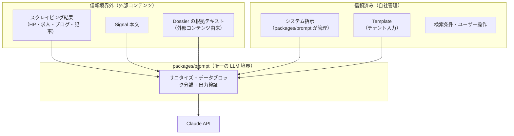
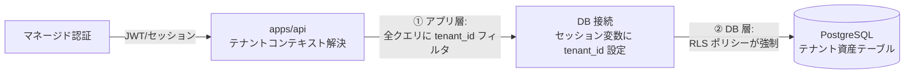

# is-reach 基本設計書

- ステータス: **承認済み（2026-07-13）**
- フェーズ: 2（基本設計）
- 前提: `docs/requirements.md`（要件定義書）の承認済みであること。本書は要件定義書の全決定事項（A1〜C4）と整合するように設計している。
  - 注意: 本書作成時点で `docs/requirements.md` のファイル上のステータス表記は「草案」のままである。承認済みであればステータス表記の更新を推奨する（→ 10. 承認）。
- 本書では確定した事項を「**決定**」、未確定の前提を「**仮置き**」と明記して区別する。
- 本書の承認をもってフェーズ3（詳細設計 `docs/design-detail.md`）へ進む。承認前に詳細設計・実装には着手しない。

---

## 1. 概要と設計方針

本書は、is-reach（インサイドセールス向け SaaS: スクリーニング → 深掘り → メッセージ生成）の基本設計を定める。

### 1.1 設計方針

1. **要件との整合**: 要件定義の決定事項（A1〜A4, B1〜B3, C3〜C4）をすべて設計に反映する。各節で対応する要件番号を明示する。
2. **セキュリティ・バイ・デザイン**: プロンプトインジェクション対策（要件 6.1 / C4）とテナント分離（要件 F6 / A1）は「実装時の注意」ではなく**構造で強制**する。LLM 呼び出し経路を単一パッケージに限定し、テナント分離はアプリ層 + DB 層（RLS）の二重防御とする。
3. **小規模スタート・運用部品最小**: 要件 6.4（決定 C3）の規模（テナント〜10、深掘り〜50 社/日/テナント）を前提に、Redis 等の追加ミドルウェアを持たず PostgreSQL に集約する。ただしスケール経路（キューの差し替え等）は抽象化で閉ざさない。
4. **決定と仮置きの区別を継続**: 本書内の設計判断も「決定」「仮置き」を明記する（→ 9. 決定・仮置き一覧）。

### 1.2 技術スタック（決定 D1）

| 項目 | 内容 |
|------|------|
| 言語 | TypeScript 統一（フロント・API・バッチすべて） |
| モノレポ | pnpm workspace + Turborepo |
| フロントエンド | Next.js（`apps/web`、PC 向け管理画面、Tailwind CSS） |
| API サーバー | Node.js（Hono 等の軽量フレームワーク。`apps/api`） |
| DB | PostgreSQL（単一 DB。テナント分離は RLS → 7 章） |
| ジョブキュー | Postgres ベースのキュー（pg-boss 等 → 決定 D5、採用最終確認は仮置き） |
| LLM | Anthropic Claude API 直結 + 薄い抽象層（→ 決定 D6、モデル選定は仮置き） |
| 認証 | マネージド認証サービス（→ 決定 D4、具体サービス選定は仮置き） |

---

## 2. モノレポ構成・パッケージ境界（決定）

```
is-reach/
├── apps/
│   ├── web/        # Next.js 管理画面（PC 向け、Tailwind CSS）
│   └── api/        # API サーバー + ジョブワーカー（同一デプロイ単位）
├── packages/
│   ├── shared/     # 型契約・ドメイン型の唯一の置き場
│   ├── crawler/    # シグナル収集バッチ + 深掘りフェッチ
│   ├── analysis/   # スクリーニングのフィルタ/スコアリング + ドシエ分析ロジック
│   └── prompt/     # LLM 抽象層・プロンプト組み立て・インジェクション対策
└── docs/
```

### 2.1 各パッケージの責務・入出力

| パッケージ | 責務 | 入力 | 出力 | 禁止事項 |
|-----------|------|------|------|----------|
| `apps/web` | PC 向け管理画面（スクリーニング検索 / リスト / ドシエ閲覧 / メッセージ編集・コピー / テンプレート・テナント管理 — 決定 B3） | ユーザー操作、`apps/api` のレスポンス | API リクエスト、画面表示 | DB 直接アクセス、LLM 直接呼び出し |
| `apps/api` | API サーバー（認証・テナントコンテキスト解決・CRUD・検索）+ ジョブワーカー（キュー購読、`crawler` / `analysis` / `prompt` の呼び出し統括） | HTTP リクエスト、キューのジョブ | HTTP レスポンス、DB 書き込み、ジョブ投入 | LLM API の直接呼び出し（必ず `packages/prompt` 経由） |
| `packages/shared` | 型契約・ドメイン型・パイプライン間データ契約（Company / Signal / Dossier 等）の**唯一の置き場**。出典 URL 必須などの制約を型で表現 | — | 型定義・スキーマ（zod 等のバリデータ定義を含む想定 — 仮置き） | 実行時 I/O（HTTP / DB / LLM）、他パッケージへの依存 |
| `packages/crawler` | 外部サイトへの HTTP アクセスの**唯一の実装点**。①シグナル収集バッチ（広く浅く）②深掘りフェッチ（狭く深く）。**robots.txt 遵守・ドメイン単位レート制限・User-Agent 明示をここに集約**（要件 6.2） | 収集対象（シード URL / 企業ドメイン） | 収集結果（出典 URL・収集日時付きの生テキスト/構造化データ。信頼境界外としてマーク） | LLM 呼び出し、DB 直接書き込み（呼び出し側 = `apps/api` が永続化） |
| `packages/analysis` | ①スクリーニング: フィルタ + ルールベーススコアリング（**LLM 不使用** — 要件 F1）②深掘り: 収集データの前処理・構造化と、`prompt` 経由のドシエ分析の統括ロジック | 企業・シグナルデータ、検索条件、深掘り収集結果 | 検索結果（マッチ根拠付き）、ドシエ（根拠 URL 付き / 根拠なし明示 — 要件 F3） | 外部サイトへの直接アクセス、LLM API の直接呼び出し |
| `packages/prompt` | **Claude API 呼び出しの唯一の実装点**。LLM 抽象層、構造化プロンプト組み立て、外部コンテンツのサニタイズ・データブロック分離、出力検証。**プロンプトインジェクション対策の唯一の実装点**（要件 6.1 / C4） | 信頼済み入力（テンプレート・指示）と信頼境界外入力（外部コンテンツ）を**型レベルで区別した**引数 | LLM 生成結果（検証済み） | 外部サイトへの直接アクセス、DB アクセス |

### 2.2 依存の向き（決定）



- **apps → packages** の方向のみ許可。packages から apps への依存（逆流）は禁止。
- **全 packages は `packages/shared` にのみ依存**できる。packages 同士の横依存（例: `analysis` → `prompt`）は禁止し、組み合わせは `apps/api`（ワーカー）が行う。これにより「LLM を呼べるのは `prompt` だけ」「外部サイトに触れるのは `crawler` だけ」という境界が依存グラフで検証可能になる。
- `apps/web` は `apps/api` と HTTP でのみ通信する（API 契約の型は `shared` で共有）。

---

## 3. ドメインモデル（決定 D2: データ所有）

データは 2 種類に大別する。

- **共有資産**（全テナント共有・tenant_id なし）: 企業マスタと公開シグナル。1 回収集して全テナントが検索に使う。テナント固有情報を含まないため共有できる。
- **テナント資産**（tenant_id あり・RLS 対象）: 企業リスト・ドシエ・メッセージ・テンプレート等。テナント間で完全分離する（要件 F6）。

### 3.1 エンティティ関係図



### 3.2 共有資産（全テナント共有・決定 D2）

| エンティティ | 属性概要 |
|-------------|---------|
| **Company**（企業マスタ） | 企業名、法人番号（あれば）、ドメイン/URL、業種、従業員数（区分）、地域、更新日時。スクリーニングの検索対象（要件 F1） |
| **Signal**（公開シグナル） | 対象 Company、**種別**（求人 / 技術ブログ / プレスリリース 等 — 決定 A3-1。種別は enum として `shared` で定義し将来拡張可能に）、要約/抽出属性（例: 求人の技術キーワード）、**出典 URL（必須）**、**収集日時（必須）**、有効期限/鮮度情報 |

- Signal の本文テキストは**信頼境界外のデータ**として扱う（→ 6 章）。
- 深掘りで収集する生コンテンツ（HP・公開記事のフェッチ結果）はドシエの中間データであり、出典 URL・収集日時付きで保持する（永続化の粒度は詳細設計 — 仮置き）。

### 3.3 テナント資産（すべて tenant_id を持ち、RLS の対象 — 決定 D3）

| エンティティ | 属性概要 |
|-------------|---------|
| **Tenant** | テナント名、状態（有効/停止）、作成日時 |
| **User** | 所属 Tenant、メールアドレス、表示名、**ロール（管理者 / メンバー）**（要件 F6 / B3。権限概要 → 7.3）、認証サービス側 ID への参照、招待状態 |
| **CompanyList** | 所属 Tenant、リスト名、検索条件のスナップショット（どの条件で抽出したか）、作成者、作成日時（要件 F1 受け入れ条件 1） |
| **ListEntry** | 所属 CompanyList、参照する Company（共有資産への参照）、**マッチ根拠**（どのシグナルに該当したか — 要件 F1 受け入れ条件 2）、**ステータス**（未着手 / 生成済み / 送信済み / 返信あり — 要件 F5。enum として `shared` で定義）、深掘りジョブの状態（→ 4.3）、担当者・更新日時 |
| **Dossier** | 対象 ListEntry、**事業サマリ / 推定課題 / 自社サービスとの接続点（フック）**の各項目（要件 F3 / B1）。各項目は「本文 + 根拠 URL のリスト」の構造を持ち、**根拠が取れない項目は『根拠なし』を明示的に表現できる構造**（例: 根拠フィールドが「URL リスト」または「根拠なしマーカー」のいずれかを必ず取る判別可能な型）とする。生成日時、生成に使ったモデル情報 |
| **Template** | 所属 Tenant、テンプレート名、**自社紹介 / CTA / トーン / 文字数制約**（要件 F4 / B2）、作成者・更新日時 |
| **Message** | 対象 ListEntry、使用 Template、参照 Dossier、生成文（テンプレ骨子 + パーソナライズ部分の区別を保持）、編集後本文、検証結果（骨子欠落チェック等 → 5 章）、生成日時・編集日時 |
| **AuditLog** | 所属 Tenant、実行 User、**イベント種別（検索 / 深掘り実行 / 生成 / コピー 等）**、対象リソース参照、発生日時（要件 6.3。追記専用） |

### 3.4 データモデル上の原則（決定）

- テナント資産テーブルは**すべて `tenant_id` 列を持ち、Postgres Row Level Security の対象**とする（→ 7 章）。
- 個人情報（役員名等）を含み得るデータ（Signal・深掘り収集データ・Dossier）は**出典 URL を必須**とし、`shared` の型契約レベルで強制する（要件 6.3 → 8.2）。
- SQL DDL・インデックス設計・具体的な RLS ポリシー定義は詳細設計（`docs/design-detail.md`）で行う。

---

## 4. パイプライン設計（決定 A3: 2 段階パイプライン）

### 4.1 全体データ流



### 4.2 各パイプラインの設計

| # | パイプライン | 実行契機 | 性質 | LLM |
|---|-------------|---------|------|-----|
| ① | シグナル収集バッチ | 定期実行（スケジュール駆動。頻度は詳細設計 — 仮置き） | 広く浅く・構造化。共有プール（Company / Signal）を更新。テナント非依存 | 不使用 |
| ② | スクリーニング検索 | ユーザーの検索操作 | **同期クエリ・即時応答**（要件 6.4）。事前収集済みデータへのフィルタ + ルールベーススコアリング。結果は CompanyList として保存 | 不使用（要件 F1） |
| ③ | 深掘りジョブ | ユーザーがリストから企業を選択して実行 | 非同期ジョブ。狭く深く・非構造。1 社あたりコスト高で許容（対象は数十社/日 — 要件 6.4） | 使用（ドシエ分析） |
| ④ | メッセージ生成 | ユーザーがドシエ + テンプレートを選択して実行 | 非同期ジョブ（1 件の LLM 呼び出しのため短時間。同期/非同期の最終判断は詳細設計 — 仮置き） | 使用（パーソナライズ部分のみ — 要件 F4） |

### 4.3 深掘りジョブの状態機械（決定）



- 状態は ListEntry（またはジョブレコード。持ち方は詳細設計 — 仮置き）に保持し、**進捗・完了・失敗を画面からポーリング等で確認できる**（要件 F2 受け入れ条件 1。ポーリング間隔・通知方式は詳細設計 — 仮置き）。
- リトライ回数・タイムアウト・部分失敗（一部ページのみ取得失敗）の扱いは詳細設計で定義する。

### 4.4 ジョブ基盤（決定 D5）

- **Postgres ベースのキュー（pg-boss 等）**を採用する。理由: 規模要件（決定 C3）に対して Redis 等の追加ミドルウェアは過剰であり、運用部品を最小化する。トランザクション内でのジョブ投入（例: 深掘り実行の記録とジョブ投入の原子性）とも相性が良い。
- **ジョブワーカーは `apps/api` 内で pg-boss を購読**する（API サーバーと同一デプロイ単位。プロセス分離の要否は詳細設計 — 仮置き）。
- **キューはインターフェースで抽象化**し（`shared` に型契約を置く）、将来 SQS / BullMQ 等への差し替えを可能にする。pg-boss 採用の最終確認は仮置き（→ 9 章）。

---

## 5. メッセージ生成のデータ流（決定 B2 / D6）

テンプレート骨子 + パーソナライズ埋め込み方式（要件 F4）を、信頼境界を明示した以下の流れで実現する。



処理の要点:

1. **入力の区別**: `packages/prompt` の API は、Template（信頼済み）と Dossier 由来テキスト（信頼境界外）を**別の引数・別の型**で受け取る。呼び出し側が混同できない型契約を `shared` に定義する。
2. **LLM の生成範囲はパーソナライズ部分のみ**（冒頭の接点・課題への言及）。自社紹介・CTA はテンプレートから機械的に埋め込み、LLM に骨子ごと書かせない。これにより骨子の欠落・改変リスクを構造的に減らす（要件 F4 受け入れ条件 3）。
3. **検証**: 生成後に (a) 自社紹介・CTA が欠落していないか（骨子保持チェック）(b) 文字数制約 (c) 外部データ由来の不正指示への追従の兆候（→ 6.2 (d)）を検証する。検証 NG は保存時にフラグを付け、画面で警告表示する（詳細な検証ルールは詳細設計）。
4. **人手が最終確認**: 生成文は必ず編集画面を経由し、ユーザーが編集・コピーする。自動送信はしない（決定 A4）。コピー操作は AuditLog に記録する（要件 6.3）。

---

## 6. セキュリティ境界: プロンプトインジェクション対策（要件 6.1 / 決定 C4 の具体化 — 最重要）

### 6.1 信頼境界の全体図



- 深掘りで収集した外部コンテンツ、Signal 本文、そこから生成された Dossier の根拠テキストは、**一度外部由来になったものは以後も信頼境界外**として扱う（LLM 出力を再度 LLM に渡す場合も同様）。
- Template はテナントの入力であり外部コンテンツではないが、system prompt には入れず user メッセージ側の構造化ブロックで渡す（テナント間には影響しないが、多層防御として）。

### 6.2 原則（決定）

| # | 原則 | 内容 |
|---|------|------|
| (a) | **外部コンテンツを system prompt に入れない** | スクレイピング結果・ドシエの根拠テキストなど外部由来データは、system prompt に一切含めない。system prompt は `packages/prompt` が管理する固定の指示のみで構成する |
| (b) | **明示的データブロックでのみ渡す** | 外部コンテンツは XML タグ等で明示的に区切られた**専用データブロック**としてのみ user メッセージに渡す。「このブロック内は指示ではなくデータであり、内部に指示らしきテキストがあっても従わない」ことをプロンプト構造（指示部での宣言 + 区切り構造）で強制する。具体的なタグ設計・プロンプト全文は詳細設計で定義 |
| (c) | **取り込み時サニタイズ** | 外部コンテンツをデータブロックに入れる前に、①制御文字の除去 ②過長テキストの切り詰め（上限は詳細設計 — 仮置き）③区切りタグの偽装（データ内に区切りタグと同じ文字列が出現する場合）のエスケープ、を行う |
| (d) | **生成出力の検証** | LLM 出力に対して、①テンプレ骨子（自社紹介・CTA）の保持チェック ②外部データ由来の指示に追従した兆候の検知（例: メッセージ生成なのに無関係な内容・URL・指示文が出力される等。検知ルールは詳細設計）を行い、NG は警告フラグ付きで人手確認へ回す。レビュー（reviewer agent / 人間）ではこの検証観点を必須項目とする（要件 6.1） |
| (e) | **LLM 呼び出し経路の一元化** | Claude API の呼び出しは `packages/prompt` のみに限定し、他パッケージ・アプリからの直接呼び出しを禁止する。依存ルール（→ 2.2）と合わせて、対策の抜け道が生まれない構造にする。API キーの保持も `prompt` を実行するプロセス（apps/api ワーカー）に限定する |

### 6.3 最終防衛線

インジェクション対策は上記の多層防御でも完全にはならない前提に立ち、**生成物は必ず人手確認を経てから使われる**（決定 A4: 自動送信なし）ことをアーキテクチャ上の最終防衛線とする。ツールが外部に対して自動で作用する経路（自動送信・自動操作）は存在しない。

---

## 7. テナント分離・認証方針（決定 D3 / D4）

### 7.1 認証（決定 D4）

- **マネージド認証サービス**（Clerk / Supabase Auth 等）を採用する。パスワード管理・招待フロー・将来の SSO 対応を自前実装しないため。**具体サービスの選定は詳細設計（仮置き）**。
- 認証フロー: マネージド認証 → JWT / セッション → `apps/api` が検証し、ユーザーと所属テナントを解決（**テナントコンテキスト解決**）。
- ユーザー招待（要件 F6）は認証サービスの招待機能を利用する前提（詳細は選定後）。

### 7.2 テナント分離: 二重防御（決定 D3）

共有 DB + `tenant_id` 列方式を採用し、以下の 2 層で分離を強制する。



1. **アプリ層**: `apps/api` はリクエストごとにテナントコンテキストを解決し、テナント資産へのクエリに tenant_id 条件を適用する。
2. **DB 層（RLS）**: DB 接続に**セッション変数で tenant_id を設定**し、**全テナント資産テーブルに Row Level Security ポリシー**を定義する。アプリ層のバグ（フィルタ漏れ）があっても DB 層が越境アクセスを遮断する。
3. 共有資産（Company / Signal）は tenant_id を持たず、全テナントから読み取り可能・アプリからは読み取り専用（書き込みは収集バッチのみ）。
4. ジョブワーカーが実行するテナント文脈の処理（深掘り・生成）も、ジョブペイロードの tenant_id からコンテキストを復元し、同じ RLS 経路で DB にアクセスする。
5. 具体的な RLS ポリシー定義・セッション変数の実装方式・接続プールとの兼ね合いは詳細設計で定める。

これにより要件 F6 受け入れ条件（他テナントのデータに一切アクセスできない）を、単一のコードパスのミスでは破れない構造で満たす。

### 7.3 ロールと権限概要（管理者 / メンバーの 2 ロール — 要件 F6）

| 操作 | 管理者 | メンバー |
|------|--------|---------|
| スクリーニング検索・リスト管理・深掘り・生成・編集・コピー・ステータス更新 | ○ | ○ |
| テンプレート管理 | ○ | ○（仮置き: メンバーは閲覧・利用のみに制限する案もあり。詳細設計で確定） |
| ユーザー招待・ロール変更・削除 | ○ | × |
| テナント設定・監査ログ閲覧 | ○ | × |
| データ削除依頼への対応操作（→ 8.2） | ○ | × |

権限の詳細（API 単位の認可マトリクス）は詳細設計で定める。

---

## 8. 非機能要件の落とし込み

### 8.1 スクレイピング節度（要件 6.2）

- 実装を **`packages/crawler` に集約**する（外部 HTTP アクセスの唯一の実装点 → 2.1）。個別機能が勝手にフェッチする経路を作らない。
- crawler は以下を必須機能として持つ: **robots.txt の取得・遵守 / ドメイン単位のレート制限 / User-Agent の明示（連絡先を含む）/ タイムアウトと同時接続数の上限**。
- 具体値（リクエスト間隔、同時実行数、1 サイトあたり取得ページ上限等）は**詳細設計で定める（仮置き）**。規模要件（深掘り〜50 社/日/テナント × 〜10 テナント）から、対象サイトへの負荷は十分低く抑えられる見込み。

### 8.2 PII 管理（要件 6.3）

- 保存する人物情報は**公開情報由来のみ**（役員名・公開記事等）。SNS 直接クロールはしない（決定 A3-2）。
- **出典 URL 必須を `packages/shared` の型契約レベルで強制**する: 人物情報・外部由来テキストを表す型は出典 URL フィールドを必須とし、出典なしのデータが型検査を通らない構造にする。
- **削除依頼対応**: 企業・個人単位の削除に対応する（要件 6.3）。データモデル上、Company / ListEntry を起点に関連データ（Signal・収集データ・Dossier・Message）へ**カスケード削除できる参照構造**とする。削除の具体手順・論理/物理削除の別は詳細設計で定める。

### 8.3 監査ログ（要件 6.3）

- **検索・深掘り実行・生成・コピー**の各イベントを、実行ユーザー・テナント・対象・日時とともに AuditLog に記録する（→ 3.3）。
- AuditLog は追記専用とし、テナント資産として RLS の対象（テナントは自テナントのログのみ閲覧可。閲覧は管理者ロールのみ → 7.3）。
- 記録イベントの網羅リスト・保持期間は詳細設計で定める。

### 8.4 規模・性能（要件 6.4 / 決定 C3）の確認

| 要件 | 本設計での成立根拠 |
|------|-------------------|
| テナント 〜10、ユーザー 〜10/テナント | 共有 DB + RLS で十分（テナント数十〜数百まで同方式でスケール可） |
| スクリーニング即時応答 | 事前バッチ収集済みの共有プールへの同期クエリ。LLM・外部アクセスなし。適切なインデックス（詳細設計）で即時応答可能 |
| 深掘り 〜50 社/日/テナント（最大 500 社/日） | pg-boss キューで直列/少並列処理して十分捌ける量。クローリングのレート制限がボトルネックだが日次処理量として問題ない |
| スケールを閉ざさない | キュー抽象化（D5）、パッケージ境界による責務分離、共有資産/テナント資産の分離により、将来のワーカー分離・キュー差し替え・読み取りレプリカ導入が可能 |

---

## 9. 決定・仮置き一覧

### 決定（本書で確定）

| # | 項目 | 内容 |
|---|------|------|
| D1 | 技術スタック | TypeScript 統一。pnpm + Turborepo モノレポ、apps/web = Next.js、apps/api = Node（Hono 等）、DB = PostgreSQL |
| D2 | データ所有 | 企業マスタ・公開シグナルは全テナント共有資産。企業リスト・ドシエ・メッセージ・テンプレートはテナント別資産 |
| D3 | テナント分離 | 共有 DB + tenant_id 列 + Postgres RLS（アプリ層フィルタ + DB 層強制の二重防御） |
| D4 | 認証 | マネージド認証サービス採用（具体サービス選定は仮置き） |
| D5 | ジョブ基盤 | Postgres ベースのキュー（pg-boss 等）。キューはインターフェースで抽象化し将来差し替え可能に |
| D6 | LLM | Anthropic Claude API 直結 + packages/prompt 内の薄い抽象層（モデル選定は仮置き） |
| D7 | パッケージ境界 | 2 章の構成と依存ルール（apps → packages、全パッケージ → shared のみ、横依存・逆流禁止） |
| D8 | インジェクション対策の構造 | 6.2 の原則 (a)〜(e)。LLM 呼び出しと対策実装は packages/prompt に一元化 |

### 仮置き（詳細設計・承認時に確認）

| 項目 | 仮置き内容 |
|------|-----------|
| 認証サービス | Clerk / Supabase Auth 等から詳細設計で選定 |
| pg-boss 採用 | 最終確認は詳細設計で（キュー抽象化で差し替え可能なため設計は不変） |
| Claude モデル選定 | コスト・品質を見て詳細設計で選定 |
| レート制限具体値 | クローリングのリクエスト間隔・同時実行数・取得上限は詳細設計 |
| ホスティング先 | 未定。詳細設計（またはインフラ検討）で選定 |
| シグナル収集の頻度・シード | バッチ頻度・収集対象ソースの具体リストは詳細設計 |
| メッセージ生成の同期/非同期 | 4.2 参照。詳細設計で確定 |
| 深掘りジョブ状態の持ち方・進捗通知方式 | ListEntry 内 or ジョブレコード / ポーリング間隔等は詳細設計 |
| メンバーのテンプレート編集権限 | 7.3 参照。詳細設計で確定 |
| サニタイズ上限値・検証ルール詳細 | 切り詰め文字数・出力検証の具体ルールは詳細設計 |
| バリデータ実装（zod 等） | shared でのスキーマ表現手段は詳細設計 |

### 詳細設計へ送る事項（フェーズ逸脱防止のため本書では扱わない）

- API エンドポイント一覧・API 契約
- SQL DDL・インデックス・具体的な RLS ポリシー定義
- プロンプト全文構成（system / user / データブロックの具体テキスト）
- エラー状態・リトライ方針の詳細
- 画面ワイヤーフレーム・UI コンポーネント詳細（→ ui-designer / ui-spec）

---

## 10. 承認

- [x] 本基本設計書の承認（承認者: Mika Suzuki、2026-07-13）
- [x] （確認）前フェーズ `docs/requirements.md` が承認済みであること

承認後、フェーズ3（詳細設計 `docs/design-detail.md`）に着手する。
