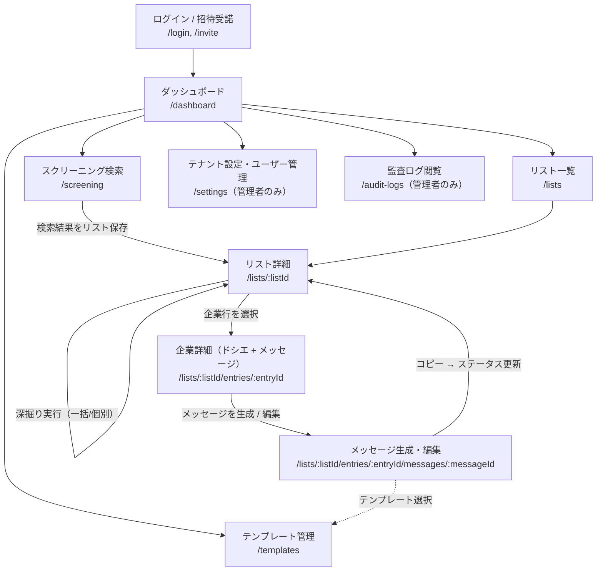

# is-reach UI 仕様書（ui-spec）

- ステータス: **草案（人間の承認待ち）**
- フェーズ: 3（詳細設計と並行する UI 仕様）
- 前提: `docs/requirements.md`（承認済み）、`docs/basic-design.md`（承認済み 2026-07-13）と整合する。
- 対象: **PC 向け管理画面**（Next.js `apps/web` + Tailwind CSS）。レスポンシブのモバイル対応はスコープ外（要件・skill 方針）。
- 本書では確定させたい事項を「**決定**」、暫定の前提を「**仮置き**」と明記して区別する。承認により「決定」が確定する。
- 本書は UI の方針・仕様までを扱う。実装コード（JSX/TSX・CSS）、ピクセル単位のビジュアル、具体的カラーコードの確定、API 契約の定義は扱わない（API は `docs/design-detail.md` の領分。本書では画面が呼ぶ操作の名前程度に留める）。

---

## 1. 概要・デザイン方針

### 1.1 対象ユーザーと利用文脈

エンドユーザーはテナント企業の IS（インサイドセールス）担当者。業務フローは次の一本道であり、UI はこの流れに沿って迷わず進めることを最優先する（決定）。

```
スクリーニング検索（条件で企業抽出）
  → リスト保存
  → リストから企業選択 → 深掘り実行（非同期ジョブ）
  → ドシエ閲覧（事業サマリ・推定課題・接続点 + 根拠 URL）
  → メッセージ生成（テンプレート選択 + ドシエ → 非同期生成）
  → 人手編集 → コピー →（各サイトのフォームで手動送信）
  → ステータス管理（未着手 / 生成済み / 送信済み / 返信あり）
```

### 1.2 レイアウト原則（決定）

- **左サイドナビ + メインエリア**の 2 カラム構成。サイドナビは固定幅（仮置き: 240px 相当のスペーシングトークン）、メインエリアは可変幅。
- メインエリア上部に**ページヘッダー**（画面タイトル・パンくず・主要アクションボタン）を置く。パンくずは「リスト一覧 > リスト名 > 企業名」のように業務フローの階層を反映する。
- 想定最小ビューポート幅は **1280px**（仮置き）。それ未満は横スクロールを許容し、モバイル向けの折り畳みは行わない。
- **情報密度は高め**に設計する（決定）。IS 担当者は 100〜500 社規模のリストを日常的に走査するため、テーブル中心・コンパクトな行高・一覧内での状態把握を優先する。装飾的な余白よりも一覧性を取る。
- モーダルは「短い確認・単純入力」に限定し、**ドシエ閲覧やメッセージ編集など長時間の作業は独立した画面（またはフル高さの詳細ペイン）で行う**（決定）。

### 1.3 言語・文言（決定）

- UI は**日本語**。ボタンは動詞で終える（「深掘りを実行」「メッセージを生成」「コピー」）。
- システムの責務境界を UI 文言で明示する。特に「**送信はこのツールからは行いません。各企業サイトの問い合わせフォームから手動で送信してください**」という文言方針を、メッセージ編集画面・コピー完了時に必ず表示する（→ 6 章）。
- 日時表示は `YYYY-MM-DD HH:mm`（JST）を標準とする（仮置き）。

### 1.4 サイドナビ構成（決定）

上から業務フロー順に並べる。

| 順 | ナビ項目 | 遷移先 | ロール |
|---|---------|--------|--------|
| 1 | ダッシュボード | `/dashboard` | 全員 |
| 2 | スクリーニング検索 | `/screening` | 全員 |
| 3 | リスト | `/lists` | 全員 |
| 4 | テンプレート | `/templates` | 全員（メンバーは閲覧・利用のみ） |
| 5 | 設定（ユーザー管理・テナント設定） | `/settings` | **管理者のみ表示** |
| 6 | 監査ログ | `/audit-logs` | **管理者のみ表示** |
| 下部 | アカウントメニュー（表示名・ロール表示・ログアウト） | — | 全員 |

---

## 2. 画面一覧と画面遷移

### 2.1 画面遷移図



### 2.2 画面一覧表

| # | 画面名 | URL パス案 | 目的 | 主要アクション | ロール制限 |
|---|--------|-----------|------|---------------|-----------|
| S0 | ログイン / 招待受諾 | `/login`, `/invite/[token]` | 認証（マネージド認証サービス連携）。招待メールのリンクから初回登録 | ログイン、招待受諾（表示名・パスワード設定） | 未認証ユーザー |
| S1 | ダッシュボード | `/dashboard` | ログイン直後の起点。作業の続きへの導線 | 最近のリスト・進行中の深掘りジョブ・ステータス集計の表示、各画面への遷移 | 全員 |
| S2 | スクリーニング検索 | `/screening` | 企業属性 + 公開シグナル条件で企業を抽出（同期・即時応答） | 条件入力、検索実行、結果プレビュー（マッチ根拠付き）、**リストとして保存** | 全員 |
| S3 | リスト一覧 | `/lists` | 保存済み CompanyList の一覧 | リストを開く、リスト名変更、削除 | 全員（削除は仮置き: 作成者 + 管理者） |
| S4 | リスト詳細 | `/lists/[listId]` | リスト内企業の一覧・ステータス管理・深掘り実行のハブ | 企業選択（複数可）、**深掘りを実行**、深掘り進捗表示、ステータス絞り込み・手動更新、企業詳細へ遷移 | 全員 |
| S5 | 企業詳細（ドシエ + メッセージ） | `/lists/[listId]/entries/[entryId]` | ドシエ閲覧（根拠 URL 付き）とメッセージ一覧 | 深掘り再実行、**メッセージを生成**（テンプレート選択）、既存メッセージを開く、ステータス更新 | 全員 |
| S6 | メッセージ生成・編集 | `/lists/[listId]/entries/[entryId]/messages/[messageId]` | 生成文の人手確認・編集・コピー | 編集、**コピー**、再生成、ステータス更新（生成済み → 送信済み） | 全員（Message 編集はメンバーも可 — 決定 E3） |
| S7 | テンプレート管理 | `/templates` | メッセージテンプレート（自社紹介・CTA・トーン・文字数制約）の管理 | 一覧・閲覧: 全員。**作成・編集・削除: 管理者のみ**（決定 E3） | 閲覧は全員、変更は管理者 |
| S8 | テナント設定・ユーザー管理 | `/settings` | ユーザー招待・ロール変更・削除、テナント設定、データ削除依頼対応 | ユーザー招待、ロール変更、無効化、テナント名等の設定 | **管理者のみ** |
| S9 | 監査ログ閲覧 | `/audit-logs` | 検索・深掘り・生成・コピー等のイベント履歴の閲覧 | 期間・ユーザー・イベント種別での絞り込み | **管理者のみ** |

- ダッシュボード（S1）は**決定（2026-07-13 人間承認）**: 「最近のリスト」「進行中の深掘りジョブ」「ステータス集計（未着手/生成済み/送信済み/返信あり の件数）」の 3 ブロックの簡易版を **MVP に含める**。実装優先度は他画面より後でよい。
- URL パス案は Next.js App Router のルーティング前提の**仮置き**。詳細設計（API・ルーティング確定）とすり合わせる。

### 2.3 各画面の責務要点（ワイヤー方針・テキストレベル）

#### S2 スクリーニング検索

```
+--------------------------------------------------------------+
| ページヘッダー: スクリーニング検索                                |
+----------------------+---------------------------------------+
| 検索条件パネル（左）    | 検索結果テーブル（右）                    |
|  企業属性             |  企業名 | 業種 | 従業員数 | 地域 |        |
|   - 従業員数（区分）   |  マッチ根拠（シグナル種別バッジ + 要約）    |
|   - 業種 / 地域       |  行クリックで根拠詳細（出典 URL リンク）     |
|  公開シグナル          |                                       |
|   - 種別 + キーワード  |  [リストとして保存] （リスト名入力モーダル） |
|  [検索する]           |                                       |
+----------------------+---------------------------------------+
```

- 検索は同期・即時応答（基本設計 4.2）。結果は最大 500 社規模のためテーブルはページネーション（仮置き: 50 件/ページ）。
- 各行に**マッチ根拠**（どのシグナルに該当したか）を必ず表示する（要件 F1 受け入れ条件 2）。シグナル種別（求人 / 技術ブログ / プレスリリース）はバッジで示す。
- 「リストとして保存」で検索条件のスナップショットとともに CompanyList を作成し、S4 へ遷移。

#### S4 リスト詳細（業務のハブ画面）

```
+--------------------------------------------------------------+
| パンくず: リスト > {リスト名}     [選択した企業を深掘り (n 社)]     |
| フィルタ: ステータス [全て|未着手|生成済み|送信済み|返信あり]        |
|          深掘り状態 [全て|未実行|実行中|完了|失敗]                 |
+--------------------------------------------------------------+
| ☑ | 企業名 | マッチ根拠 | 深掘り状態      | ステータス   | 更新日時 |
| ☑ | A 社   | 求人:React | ● 分析中 40%相当 | 未着手      | ...     |
| ☐ | B 社   | PR:資金調達 | ✓ 完了         | 生成済み ▼  | ...     |
| ☐ | C 社   | ブログ     | ✗ 失敗 [再実行]  | 未着手      | ...     |
+--------------------------------------------------------------+
```

- チェックボックスで複数選択 → 「選択した企業を深掘り」で一括実行。深掘り済み・実行中の企業は選択時に注記（再実行の確認）。
- **深掘り状態列**はジョブ状態（queued / collecting / analyzing / done / failed）を日本語ラベル + 色で表示（→ 4.5）。実行中はこの画面がポーリングで自動更新される。
- **ステータス列**はインライン編集可能なセレクト（未着手 / 生成済み / 送信済み / 返信あり）。手動更新（要件 F5）。
- 企業名クリックで S5 へ。

#### S5 企業詳細（ドシエ + メッセージ)

```
+--------------------------------------------------------------+
| パンくず: リスト > {リスト名} > {企業名}                          |
| 企業基本情報（業種・従業員数・地域・ドメインへの外部リンク）          |
| ステータス: [生成済み ▼]   深掘り: 完了 (2026-07-12) [再実行]     |
+------------------------------+-------------------------------+
| ドシエ（左・主領域）            | メッセージ（右ペイン）            |
|  ■ 事業サマリ                 |  [メッセージを生成]              |
|    本文（プレーンテキスト）      |   （テンプレート選択 → 実行）      |
|    根拠: url1 ↗, url2 ↗      |  生成済みメッセージ一覧            |
|  ■ 推定課題                   |   - 2026-07-12 テンプレA ⚠警告   |
|    本文 / 根拠: url ↗         |   - 2026-07-10 テンプレB         |
|  ■ 接続点（フック）            |                                |
|    本文 / [根拠なし]           |                                |
+------------------------------+-------------------------------+
```

- ドシエ各項目（事業サマリ / 推定課題 / 接続点）は「本文 + 根拠 URL リスト」または「本文 + **根拠なしバッジ**」を必ず表示する（要件 F3 受け入れ条件 2）。根拠なし項目には「この項目には出典が確認できていません。事実として扱わないでください」の注記を添える。
- ドシエ本文・根拠テキストは外部由来のためプレーンテキスト表示（→ 7 章）。
- 深掘り未実行の場合、左領域は空状態（→ 4.3）とし「深掘りを実行」ボタンを中央に置く。実行中はプログレス表示（→ 4.5）。

#### S6 メッセージ生成・編集 → 詳細は 6 章。

#### S7 テンプレート管理

- 一覧（テンプレート名・更新日時・更新者）+ 詳細/編集フォーム（自社紹介・CTA・トーン・文字数制約）。
- メンバーには一覧・詳細を**読み取り専用**で表示し、「新規作成」「編集」「削除」ボタンは非表示（→ 8 章）。

#### S8 / S9 設定・監査ログ

- S8: ユーザー一覧テーブル（メール・表示名・ロール・招待状態）+ 「ユーザーを招待」モーダル（メールアドレス + ロール選択）。ロール変更・無効化は行内アクション。
- S9: 監査ログテーブル（日時・ユーザー・イベント種別・対象リソース）。期間 / ユーザー / イベント種別（検索・深掘り実行・生成・コピー等）のフィルタ。**閲覧専用・編集操作なし**（追記専用データのため）。

---

## 3. 主要 UI コンポーネント方針

### 3.1 コンポーネント粒度: 2 層構成（決定）

`apps/web` 内のコンポーネントは次の 2 層に分ける。

| 層 | 置き場所（案） | 内容 | ルール |
|----|--------------|------|--------|
| **ui/（汎用層）** | `apps/web/src/components/ui/` | ドメイン知識を持たない汎用部品: Button, Badge, Table, Card, Modal, Select, TextInput, Textarea, Tabs, Skeleton, Spinner, Toast, EmptyState, ErrorState, Pagination, ExternalLink | ドメイン型（Dossier 等）に依存しない。Tailwind トークンのみで見た目を構成 |
| **feature/（機能層）** | `apps/web/src/features/{機能名}/components/` | 業務部品: ScreeningConditionForm, SignalBadge, MatchEvidencePopover, DeepDiveStatusBadge, DeepDiveProgress, EntryStatusSelect, DossierSection, EvidenceLinkList, NoEvidenceBadge, MessageEditor, ValidationWarningBanner, TemplateForm, InviteUserModal, AuditLogTable | ui/ 層を組み合わせて構成。機能ディレクトリを跨ぐ import は禁止（共通化したくなったら ui/ へ昇格） |

- 機能名ディレクトリ案: `screening` / `lists` / `dossier` / `messages` / `templates` / `settings` / `audit`（仮置き。詳細設計のルーティングと揃える）。
- ページ（route）はレイアウトとデータ取得の結線のみを担い、表示ロジックは feature 層に置く。

### 3.2 命名規則（決定）

- コンポーネント名は **PascalCase・英語**、`{ドメイン}{部品種別}` の順（例: `DeepDiveStatusBadge`, `DossierSection`, `MessageEditor`）。
- 状態表現の共通部品は `{状態}State` で統一: `EmptyState` / `ErrorState` / `ForbiddenState` / `LoadingState`。
- 外部リンクは必ず `ExternalLink` コンポーネント経由とする（素の `<a>` 禁止 → 7 章のセキュリティ規則を一点に集約するため）。同様に外部由来テキストの表示は `SafeText`（プレーンテキスト表示専用部品）経由とする（決定）。

### 3.3 Tailwind トークン方針（決定: 構造 / 仮置き: 具体値）

具体的カラーコードは本書では確定しない。**セマンティックトークンの構造**を決定とし、実値は実装フェーズの初回 PR で仮値を置き、承認を経て調整する。

#### セマンティックカラートークン（決定: トークン名）

| トークン | 用途 | 実値 |
|---------|------|------|
| `primary` | 主要アクション（検索・深掘り実行・生成・保存）、リンク、選択状態 | 仮置き（青系を想定） |
| `danger` | 削除・失敗状態（failed）・破壊的操作の確認 | 仮置き（赤系） |
| `warning` | **検証警告フラグ**・根拠なし・注意喚起 | 仮置き（黄〜橙系） |
| `success` | 完了（done）・保存成功・「返信あり」 | 仮置き（緑系） |
| `neutral` | テキスト・ボーダー・背景の段階（`neutral-50`〜`900` 相当のスケール） | 仮置き（グレー系） |

- 各カラーは `DEFAULT / hover / subtle（淡い背景用）/ on（文字色）` の派生を持つ構造とする（仮置き）。
- Tailwind の設定でセマンティック名を定義し、**コンポーネントからは raw カラー（`red-500` 等）を直接使わずセマンティックトークンのみ使う**（決定）。

#### タイポグラフィスケール（仮置き）

| トークン | 用途 |
|---------|------|
| `text-xs` | 補足・メタ情報（日時・出典 URL 表示） |
| `text-sm` | **本文標準**（テーブルセル・フォーム。情報密度優先のため sm を標準とする） |
| `text-base` | ドシエ本文・メッセージ本文（読む量が多い領域は一段大きく） |
| `text-lg` / `text-xl` | セクション見出し / ページタイトル |

- フォント: 日本語 UI 前提のシステムフォントスタック（仮置き。Web フォント導入は行わない方針）。

#### スペーシング（仮置き）

- Tailwind 標準スケール（4px 基準）をそのまま使う。独自スケールは追加しない。
- 密度基準: テーブル行のパディングは `py-2` 相当、カード・パネル内は `p-4` 相当、画面外周は `p-6` 相当を目安とする。

---

## 4. 状態表現の標準（全画面共通パターン）

すべての一覧・詳細画面は以下の状態を必ず定義し、共通コンポーネント（3.2）で表現する（決定）。

### 4.1 ローディング

- **スケルトン**: ページ初回表示・一覧の再取得など「レイアウトが既知」の読み込みに使う。テーブルは行スケルトン、ドシエはセクションスケルトン。
- **スピナー**: ボタン押下後のインライン待ち（保存・検索実行・コピー処理など短時間の操作）に使う。ボタン内スピナー + ボタン無効化。
- 使い分け基準（決定）: **画面・領域の置き換え = スケルトン、操作へのフィードバック = スピナー**。

### 4.2 空状態（EmptyState）

初回導線付きで表示する（決定）。各画面の空状態文言・導線:

| 画面 | 空状態メッセージ | 導線ボタン |
|------|----------------|-----------|
| リスト一覧 | 「まだリストがありません。スクリーニング検索から企業を抽出して保存しましょう」 | → スクリーニング検索へ |
| リスト詳細（0 社） | 「このリストに企業がありません」 | →（仮置き）検索条件で再検索へ |
| 企業詳細・ドシエ未生成 | 「まだ深掘りが実行されていません」 | 「深掘りを実行」 |
| 企業詳細・メッセージ 0 件 | 「まだメッセージがありません」 | 「メッセージを生成」 |
| テンプレート 0 件（管理者） | 「テンプレートを作成すると、メッセージ生成で選択できるようになります」 | 「テンプレートを作成」 |
| テンプレート 0 件（メンバー） | 「利用できるテンプレートがありません。管理者に作成を依頼してください」 | なし |
| 監査ログ（絞り込み結果 0） | 「条件に一致するログがありません」 | フィルタクリア |

### 4.3 エラー（ErrorState）

- 取得エラー: 領域単位でエラーメッセージ +「再試行」ボタン。画面全体を壊さない（他の領域は表示を維持）。
- 操作エラー（保存失敗等）: トースト（danger）で通知し、入力内容は保持する。
- エラーメッセージにはサーバー由来の生メッセージを直接出さず、ユーザー向け文言 + 参照 ID（仮置き: リクエスト ID）を表示する。

### 4.4 権限なし（ForbiddenState）

- ナビ非表示（→ 8 章）が第一線だが、URL 直打ちで管理者専用画面に到達した場合は ForbiddenState を表示: 「この画面は管理者のみ利用できます」+ ダッシュボードへ戻る導線。
- ボタン単位の権限（テンプレート編集等）は**非表示**を原則とする。disabled + ツールチップ方式は採らない（メンバーに「操作できるはずのものが壊れている」と誤認させないため）（決定）。

### 4.5 非同期ジョブの UX（深掘り / メッセージ生成）— 本書の重点

#### 深掘りジョブ（queued / collecting / analyzing / done / failed）

- 状態の日本語ラベルと表現（決定）:

| 状態 | ラベル | 表現 |
|------|--------|------|
| queued | 待機中 | neutral バッジ + スピナー（小） |
| collecting | 収集中 | primary バッジ + 不定プログレスバー。「公開情報を収集しています」 |
| analyzing | 分析中 | primary バッジ + 不定プログレスバー。「収集した情報を分析しています」 |
| done | 完了 | success バッジ + 完了日時 |
| failed | 失敗 | danger バッジ + **「再実行」ボタン** + 失敗理由の要約（取得可能な範囲で） |

- 進捗はパーセントではなく**フェーズ表示**とする（決定）。基本設計の状態機械にパーセント情報がないため、擬似的な進捗バーで誤解を与えない。ステップインジケータ「収集 → 分析 → 完了」で現在位置を示す。
- **ポーリング**: 実行中（queued/collecting/analyzing）のエントリが画面内にある間のみポーリングし、全件終了で停止する。間隔は仮置き 5 秒（確定は詳細設計）。ポーリング中であることは深掘り状態列の表示更新で暗黙に伝わるため、別途のインジケータは置かない。
- 一括実行時: リスト詳細の各行が個別に状態遷移する。ヘッダーに「深掘り実行中: n 社」の集計表示（仮置き）。
- 失敗時: 行内「再実行」で failed → queued に戻す（基本設計 4.3 の状態機械に対応）。再実行も監査ログ対象。

#### メッセージ生成（非同期）

- 生成実行後、メッセージ編集画面（S6）に即遷移し、本文領域に生成中状態を表示: スケルトン + 「メッセージを生成しています…」。ポーリングで完了を検知して本文を表示する（間隔は深掘りと同じ仮置き 5 秒。生成は短時間想定のため 2 秒案もあり — 詳細設計で確定）。
- 生成失敗: 本文領域に ErrorState + 「再生成」ボタン。テンプレート選択は保持する。
- 生成中はページ離脱可能とし、企業詳細（S5）のメッセージ一覧に「生成中」バッジを出す。

---

## 5. （欠番 — 状態表現は 4 章に統合）

> 章番号を課題指定の構成に合わせるための欠番。次章がメッセージ編集画面。

---

## 6. メッセージ編集画面（S6）の要件 — 本書の最重要画面

自動送信機能は存在せず、**生成文は必ずこの画面での人手確認・編集・コピーを通る**（決定 A4 / 基本設計 6.3 の最終防衛線）。

### 6.1 画面構成（テキストワイヤー）

```
+----------------------------------------------------------------------+
| パンくず: リスト > {リスト名} > {企業名} > メッセージ                      |
| テンプレート: {テンプレ名}  生成日時: ...  [再生成]                       |
+----------------------------------------------------------------------+
| ⚠ 検証警告バナー（警告フラグがある場合のみ・warning 色）                    |
|   「この生成文は自動検証で警告が検出されました: {理由の要約}。               |
|     内容を必ず確認し、必要に応じて修正または再生成してください」             |
+---------------------------------+------------------------------------+
| 編集エリア（左・主領域）            | 参照ペイン（右）                      |
|  ┌ テンプレ骨子（自社紹介）――淡背景  |  ドシエ要約（読み取り専用）             |
|  ├ パーソナライズ部分 ――白背景+左帯 |   - 推定課題 / 接続点 + 根拠 URL ↗    |
|  ├ テンプレ骨子（CTA）――淡背景     |   - 編集中に根拠を確認できる            |
|  └（全体が 1 つの編集可能本文）      |                                    |
|  文字数: 412 / 500（テンプレ制約）  |                                    |
+---------------------------------+------------------------------------+
| [変更を保存]   [本文をコピー]（primary・大）                              |
| ℹ 送信はこのツールからは行いません。各企業サイトの問い合わせフォームから       |
|   手動で送信してください。コピー操作は監査ログに記録されます。               |
+----------------------------------------------------------------------+
```

### 6.2 テンプレ骨子とパーソナライズ部分の視覚的区別（決定）

- Message はテンプレ骨子とパーソナライズ部分の区別を保持している（基本設計 3.3）。編集画面では:
  - **テンプレ骨子部分**: 淡い背景（`neutral-subtle` 相当）+ 「テンプレート」ラベル。
  - **パーソナライズ部分（LLM 生成）**: 通常背景 + 左ボーダー帯（primary）+ 「AI 生成 — 内容を確認してください」ラベル。
- **どちらも編集は可能**とする（決定。骨子も最終的に人間が責任を持って調整できるべきため）。ただし骨子部分を編集した場合、「テンプレートの骨子から変更されています」の注記を付す（仮置き: 検証との整合は詳細設計で確定）。
- 区別表示は**初期表示（未編集時）のセグメント情報に基づく**。編集で境界が崩れた後の追跡は行わず、大きく編集された場合は「編集済み」表示に切り替える（仮置き）。

### 6.3 検証警告の表示（決定）

- 基本設計 5 章の検証（骨子欠落・文字数制約・不審な出力の兆候）で NG フラグが付いた Message は:
  1. 編集画面最上部に **warning 色の警告バナー**（理由の要約付き）を表示する。
  2. 企業詳細（S5）のメッセージ一覧・リスト詳細でも **⚠ バッジ**を表示する。
  3. 警告付きメッセージのコピー時は、確認ダイアログを一段挟む: 「このメッセージには検証警告があります。内容を確認しましたか？ [キャンセル] [確認済み・コピーする]」（決定）。
- 警告はブロッキングではない（コピー自体は可能）。人間の確認を強制するのが目的であり、業務を止めるのが目的ではない。

### 6.4 編集 → コピーの動線（決定）

1. 編集は明示保存（「変更を保存」）。未保存変更がある状態での離脱・コピーには確認を出す（コピーは**保存済み本文**に対して行う。「保存してコピー」を提供 — 仮置き）。
2. 「本文をコピー」でクリップボードにプレーンテキストとしてコピー。成功トースト: 「コピーしました。各企業サイトのフォームから手動で送信してください」。
3. コピー成功後、**ステータスを「送信済み」に更新するかを促すインライン提案**を表示する（自動では変えない — 送信はツール外の行為であり、ツールが送信完了を知り得ないため）（決定）。
4. **コピー操作は監査ログに記録される**ことを画面フッターに常時明記する（6.1 の ℹ 文言）。ユーザーへの透明性のため事後通知ではなく事前明示とする。

### 6.5 文言方針（決定）

- 「送信」という語をこのツールの操作名に**使わない**。ボタン・アクション名は「コピー」「ステータスを送信済みにする」まで。「送信する」ボタンは存在しない。
- AI 生成部分には「AI 生成」ラベルを付け、確認を促す文言を添える。「自動で最適化済み」のような確認不要と誤認させる文言は禁止。

---

## 7. 外部由来テキストの表示原則（セキュリティ — 決定）

シグナル本文・マッチ根拠・深掘り収集データ・ドシエ本文・LLM 生成文は、すべて**信頼境界外のデータ**（基本設計 6.1。LLM 出力も外部コンテンツ由来のため同様）。表示側の原則を以下に定める。**本章はすべて決定であり、実装レビューの必須確認項目とする。**

1. **常にプレーンテキスト表示**: 外部由来テキストは React の通常のテキストレンダリング（自動エスケープ）で表示する。**`dangerouslySetInnerHTML` の使用は禁止**。外部由来テキストを HTML / Markdown としてレンダリングしない（生成文のリッチ表示が将来必要になっても、サニタイズ済みレンダラの導入を別途設計・承認するまで行わない）。
2. **表示専用コンポーネントに集約**: 外部由来テキストの表示は `SafeText`（改行の反映は CSS の `whitespace-pre-wrap` 相当で行い、HTML 解釈はしない）を経由する。過長テキストは行数制限 + 「すべて表示」で展開（仮置き: 既定 6 行）。
3. **出典 URL リンクの規則**（`ExternalLink` コンポーネントに集約）:
   - `target="_blank"` + **`rel="noopener noreferrer"` を必須**とする。
   - **外部リンク明示アイコン**（↗ 相当）を必ず付け、アプリ内遷移と区別する。
   - **リンク先 URL 自体を表示する**（偽装対策）: リンクテキストは URL のホスト名 + パス（長い場合は省略表示）とし、任意のラベル文字列でリンク先を隠さない。ホバー時にフル URL をツールチップ表示（仮置き）。
   - `http(s)` 以外のスキーム（`javascript:` 等）はリンク化せずプレーンテキスト表示にフォールバックする。
4. **URL の由来明示**: 出典 URL はスクレイピング由来のデータであり、それ自体信頼境界外。クリックで外部サイトに遷移することが視覚的に明確であること（アイコン + ホスト名表示）を必須とする。
5. 入力エコー（検索キーワード等ユーザー入力の再表示）も同じくエスケープ前提のプレーンテキスト表示とする。

---

## 8. ロール別表示制御（管理者 / メンバー — 決定 E3 の画面反映）

方針（決定）: **メンバーに不可の機能は「非表示」**（disabled ではなく）。サーバー側認可が本線であり、UI の出し分けは体験調整である（UI 非表示をセキュリティ境界とみなさない）。

| UI 要素 | 管理者 | メンバー |
|---------|--------|---------|
| ナビ「設定」（S8） | 表示 | **非表示** |
| ナビ「監査ログ」（S9） | 表示 | **非表示** |
| テンプレート一覧・詳細の閲覧 / 生成時の選択 | ○ | ○ |
| テンプレート「新規作成」「編集」「削除」ボタン | 表示 | **非表示**（詳細画面は読み取り専用表示） |
| ユーザー招待・ロール変更・無効化 | ○ | —（画面ごと非表示） |
| テナント設定・データ削除依頼対応 | ○ | —（画面ごと非表示） |
| 監査ログ閲覧 | ○ | —（画面ごと非表示） |
| スクリーニング / リスト / 深掘り / ドシエ閲覧 | ○ | ○ |
| メッセージ生成・**編集**・コピー・ステータス更新 | ○ | ○（Message 編集はメンバー可 — 決定 E3） |
| リスト削除 | ○ | 仮置き: 作成者本人のみ可（詳細設計で確定） |
| アカウントメニューのロール表示（「管理者」/「メンバー」バッジ） | 表示 | 表示 |

- URL 直打ちで管理者専用画面に到達した場合は ForbiddenState（→ 4.4）。

---

## 9. 決定・仮置き一覧

### 決定（本書で確定 — 承認により有効）

| # | 項目 | 内容 |
|---|------|------|
| U1 | レイアウト | 左サイドナビ + メインエリア。情報密度高め・テーブル中心。日本語 UI。長時間作業はモーダルでなく画面で行う |
| U2 | 画面構成 | 2.2 の S0〜S9 の 10 画面と遷移。ダッシュボード（S1）は 3 ブロック簡易版を MVP に含める（人間承認済み） |
| U3 | コンポーネント 2 層 | ui/（汎用・ドメイン非依存）と feature/（機能別）。feature 間 import 禁止。PascalCase・`{ドメイン}{部品種別}` 命名 |
| U4 | Tailwind トークン構造 | セマンティックトークン（primary / danger / warning / success / neutral）のみ使用。raw カラー直接使用禁止。実値は仮置き |
| U5 | 状態表現の標準 | スケルトン=領域置換 / スピナー=操作フィードバック、空状態は初回導線付き、エラーは再試行導線、権限なしは非表示原則 + ForbiddenState |
| U6 | 非同期 UX | 深掘りはフェーズ表示（パーセント表示しない）+ ポーリング + 失敗時再実行ボタン。メッセージ生成は編集画面内で生成中表示 |
| U7 | メッセージ編集 | 骨子=淡背景 / AI 生成=左帯+「AI 生成」ラベルで視覚区別。両方編集可。警告バナー + 警告付きコピーは確認ダイアログ。コピーの監査ログ記録を事前明示。「送信」ボタンは存在させず、手動送信の案内文言を常時表示。コピー後のステータス更新は提案のみ（自動更新しない） |
| U8 | 外部由来テキスト | 7 章全項目: プレーンテキスト表示・dangerouslySetInnerHTML 禁止・SafeText / ExternalLink への集約・rel="noopener noreferrer" + 外部アイコン + URL 表示・危険スキーム排除 |
| U9 | ロール別表示 | 8 章の表。不可機能は非表示。UI 出し分けはセキュリティ境界としない（サーバー認可が本線） |

### 仮置き（承認時・実装時に確認）

| 項目 | 仮置き内容 |
|------|-----------|
| URL パス構成 | 2.2 の案。詳細設計のルーティングと整合させて確定 |
| 最小ビューポート幅 | 1280px |
| カラー実値・派生構造 | セマンティック名のみ確定。実値と DEFAULT/hover/subtle/on 構造は実装初回 PR で提示 |
| タイポグラフィ / スペーシング具体値 | 3.3 の目安値。システムフォントスタック |
| ページネーション件数 | 50 件/ページ |
| ポーリング間隔 | 深掘り 5 秒 / メッセージ生成 5 秒（2 秒案あり）— 詳細設計で確定 |
| 骨子編集時の扱い | 編集可 + 注記表示。検証ロジックとの整合は詳細設計 |
| 「保存してコピー」動線 | 未保存時の扱いの詳細 |
| リスト削除権限 | 作成者本人 + 管理者 |
| 外部由来テキストの既定表示行数 | 6 行 + 展開 |
| 日時フォーマット | `YYYY-MM-DD HH:mm`（JST） |

---

## 10. 承認

- [ ] 本 UI 仕様書の承認（承認者: ）
- [x] （確認）ダッシュボード（S1）の扱い: **簡易版を MVP に含める**（2026-07-13 決定）

承認後、本書は実装フェーズ（feature-dev / PR 分割計画 `docs/pr-plan.md`）の入力となる。
